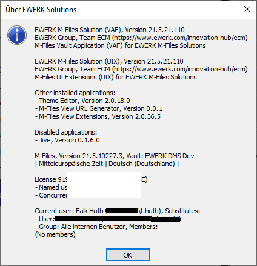

<a name="topOfPage"/>
# CustomApplicationExtensionMethods

> This is the extension of the class [MFilesAPI.CustomApplication](https://www.m-files.com/api/documentation/index.html#MFilesAPI~CustomApplication.html)
where methods for better parent / child application handling has been added by EWERK, originally to use it
for an About MessageBox shown as action for a custom command implemented via a child [UIX application](https://developer.m-files.com/Frameworks/User-Interface-Extensibility-Framework/).

<h2 style="margin-top: 40px">Table Of Content</h2>
<div style="background-color: #E9E7D8; padding: 20px 20px 5px 20px; ">

[1. Background information (class and use case)][]

[2. Useful links which should be known to all developers][]

[3. Using CustomApplicationManagement][]

  - [3.1. Client part: ``shellui.js`` &rarr; ``Event_CustomCommand``][]
  - [3.2. Server part: ``VaultApplication.cs`` &rarr; ``AboutVaultExtensionMethod``][]
  - [3.3. Screenshot: Information about EWERK Solution App as simple MessageBox][]

[4. ``MFilesAPI.Extensions.CustomApplicationExtensionMethods``][]

- [4.1. ``IsRootApplication()``][]
- [4.2. ``IsChildApplication()``][]
- [4.3. ``IsMasterApplicationOf(CustomApplication)``][]
- [4.4. ``IsChildApplicationOf(CustomApplication)``][]
- [4.5. ``GetMasterCustomApplication(Vault)``][]
- [4.6. ``GetAllChildApplications(Vault)``][]
- [4.7. ``GetAllOtherRootApplications(Vault)``][]
- [4.8. ``GetAllOtherChildApplications(Vault)``][]

[5. About EWERK as Contributer][]

</div>

&nbsp;

<div align="right"><a href="#topOfPage">Top</a></div>

## 1. Background information (class and use case)


which handles all applications installed for the current vault such as Compliance Kit or own Vault Application Framework (VAF) implementations.
The scope of the term &quot;custom&quot; in &quot;custom application&quot; contains

- &quot;Custom applications&quot; provided by M-Files directly, e.g. Compliance Kit
- 3^rd^ party solutions such as ProcessMap by Electric Paper
- General solutions of M-Files partners for their customers
- Special project-specific applications implemented by M-Files partners or perhaps also
by well-trained &quot;slightly nerdy&quot; staff of customers

All installed custom applications can be requested by calling

- [env.Vault.CustomApplicationManagementOperations.GetCustomApplications()](https://www.m-files.com/api/documentation/index.html#MFilesAPI~VaultCustomApplicationManagementOperations~GetCustomApplications.html)
- [env.Vault.CustomApplicationManagementOperations.GetCustomApplication(string myApplicationID)](https://www.m-files.com/api/documentation/index.html#MFilesAPI~VaultCustomApplicationManagementOperations~GetCustomApplication.html)

Within the sample we imagine an UIX child application which is installed together with the Vault
Application as described in Developer Portal.

&nbsp;

<div align="right"><a href="#topOfPage">Top</a></div>

## 2. Useful links which should be known to all developers


Should be known to all developers (list not complete):

- [M-Files Developer Portal](https://developer.m-files.com)
- [M-Files Community](https://community.m-files.com)
- [M-Files Homepage](https://m-files.com/de)
- [M-Files on GitHub](https://github.com/M-Files) <span style="margin-left: 20px;">(Community Extensions like this, Sample implementations etc.)</span>

Some practical advises as background for using this extension:

- [Distributing Child Applications](https://developer.m-files.com/Frameworks/Vault-Application-Framework/Distributing-Child-Applications/)
- [Master Application Guid](https://developer.m-files.com/Frameworks/User-Interface-Extensibility-Framework/Application-Definition/Master-Application-Guid/)
- [UIX Framework Object Life Cycle](https://developer.m-files.com/Frameworks/User-Interface-Extensibility-Framework/Development-Practices/Object-Lifecycle/)
- [Asynchronous API Programming](https://developer.m-files.com/Frameworks/User-Interface-Extensibility-Framework/Development-Practices/Asynchronous-API-Programming/)

Contribution sources:

- [ComAPI extension](https://github.com/M-Files/COMAPI.Extensions.Community) <span style="margin-left: 20px;">(Original M-Files location)</span>
- [ComAPI extension](https://github.com/falk-huth-ewerk/COMAPI.Extensions.Community) <span style="margin-left: 20px;">(Forked by Falk Huth, EWERK - for implementing this)</span>

<div align="right"><a href="#topOfPage">Top</a></div>

## 3. Using CustomApplicationManagement

The following sample is taken from the event handler included via UI Extensibility Framework (UIX)
while executing the <nobr><i>About command</i></nobr> where a special custom event id will be sent
to the server via API call every time the command will be called by the user.

For the configuration in this example the id was defines as
<nobr>``EWERK.MFiles.Solutions.About``</nobr>.

<div align="right"><a href="#topOfPage">Top</a></div>

### 3.1. Client part: ``shellui.js`` &rarr; ``Event_CustomCommand``

Note: For detailled function description see developer portal and other ressources. Some parts and
the description will be left out if the function is clear.

```javascript
// NOTE! This code is for demonstration purposes only and does not contain any kind of
// 		 error handling. MUST be revised before using in production.

"use strict";

var AboutExtensionName = "EWERK.MFiles.Solutions.About";
var AboutCommandLabel = "Über EWERK Solutions";

function OnNewShellUI(shellUI) {
    /// <summary>Executed by the UIX when a ShellUI module is started.</summary>
    /// <param name="shellUI" type="MFiles.ShellUI">The shell UI object which was created.</param>

    // This is the start point of a ShellUI module.

    // Register to be notified when a new normal shell frame (Event_NewNormalShellFrame) is created.
    // We use Event_NewNormalShellFrame rather than Event_NewShellFrame as this won't fire for history (etc.) dialogs.
    // ref: https://www.m-files.com/UI_Extensibility_Framework/index.html#Event_NewNormalShellFrame.html
    shellUI.Events.Register(
        Event_NewNormalShellFrame,
        handleNewNormalShellFrame);
}

function handleNewNormalShellFrame(shellFrame) {
    /// <summary>Handles the OnNewNormalShellFrame event for an IShellUI.</summary>
    /// <param name="shellFrame" type="MFiles.ShellFrame">The shell frame object which was created.</param>

    // The shell frame was created but it cannot be used yet.
    // The following line would throw an exception ("The object cannot be accessed, because it is not ready."):
    // shellFrame.ShowMessage("A shell frame was created");

    // Register to be notified when the shell frame is started.
    shellFrame.Events.Register(
        Event_Started,
        getShellFrameStartedHandler(shellFrame));
}

function getShellFrameStartedHandler(shellFrame) {
    /// <summary>Returns a function which handles the OnStarted event for an IShellFrame.</summary>
    /// <param name="shellFrame" type="MFiles.ShellFrame">The shell frame object which was created.</param>

    // The shell frame is now started and can be used.

    return function () {
        // Add and register the about command as separate function call
        registerAboutCommand(shellFrame);
    }
}


function registerAboutCommand(shellFrame) {
    /// <summary>Add and register the about command.</summary>
    /// <param name="shellFrame" type="MFiles.ShellFrame">The shell frame object which was created.</param>

    // Stop here if the user is not an admin - logic can be found in M-Files Theme Editor code
    if (!isAdmin(shellFrame))
        return;

    try {
        // Create a command (button).  Note that it is not yet visible.
        // ref: https://www.m-files.com/UI_Extensibility_Framework/index.html#MFClientScript~ICommands~CreateCustomCommand.html
        var commandAboutId = shellFrame.Commands.CreateCustomCommand(AboutCommandLabel);

        // Set the icon for the command.
        try {
            shellFrame.Commands.SetIconFromPath(commandAboutId, "assets/icon/ewerk.ico");
        } catch (ex) { }

        // Add the commands to the task area.
        // ref: https://www.m-files.com/UI_Extensibility_Framework/index.html#MFClientScript~ITaskPane~AddCustomCommandToGroup.html
        shellFrame.TaskPane.AddCustomCommandToGroup(commandAboutId, TaskPaneGroup_ViewAndModify, 1);

        // Set the command state active
        // ref: https://www.m-files.com/UI_Extensibility_Framework/index.html#MFClientScript~ICommands~SetCommandState.html
        shellFrame.Commands.SetCommandState(commandAboutId, CommandLocation_All, CommandState_Active);

        // Register to be notified when a custom command is clicked.
        // Note: this will fire for ALL custom commands, so we need to filter out others.
        shellFrame.Commands.Events.Register(
            Event_CustomCommand,
            function (commandId) {
                // Branch depending on the Id of the command that was clicked.
                switch (commandId) {

                    case commandAboutId:

                        // Show about message box
                        showAboutMessage(shellFrame);
                        break;

                }
            });
    }
    catch (e) {
        // Anweisungen für jeden Fehler
        shellFrame.ShowMessage(e);
    }
}


function showAboutMessage(shellFrame) {
    /// <summary>Handles displaying about message box.</summary>
    /// <param name="shellFrame" type="MFiles.ShellFrame">The shell frame object which was created.</param>

    try {
        // Call the extension method passing the string "world" as the parameter.
        // Note: this is called async for compatibility with M-Files Web Access.
        // ref: https://www.m-files.com/api/documentation/index.html#MFilesAPI~VaultExtensionMethodOperations~ExecuteVaultExtensionMethod.html
        shellFrame.ShellUI.Vault.Async.ExtensionMethodOperations.ExecuteVaultExtensionMethod(
            AboutExtensionName, // The name of the extension method to execute.
            shellFrame.ShellUI.Vault.SessionInfo.UserID, // The input (string) to pass it.
            function (response) {
                // The output (string) will be in response; show it.
                shellFrame.ShowMessage(
                    {
                        caption: AboutCommandLabel,
                        message: response,
                        icon: "information"
                    }
                );
            },
            function (shorterror, longerror, errorobj) {
                // Report the error
                MFiles.ReportException(errorobj);
            },
            function () {
                // Clean up any resources required.
            }
        );
    }
    catch (e) {
        // Anweisungen für jeden Fehler
        shellFrame.ShowMessage(e);
    }
}


function isAdmin(shellFrame) {
    /// <summary>Determines if the current user is an admin.</summary>
    /// <param name="shellFrame" type="MFiles.ShellFrame">The shell frame object which was created.</param>
    /// <returns>True if the user is an admin, false otherwise.</returns>

    // logic deleted for better overview (see M-Files Theme Editor code for full code of this function)
    return true;
}
```

&nbsp;

<div align="right"><a href="#topOfPage">Top</a></div>

### 3.2. Server part: ``VaultApplication.cs`` &rarr; ``AboutVaultExtensionMethod``
```csharp
/// <summary>
/// The name of the vault extension method that should be executed when the "VAF" command is executed.
/// </summary>
private const string ABOUT_EXTENSION_NAME ="EWERK.MFiles.Solutions.About";

/// <summary>
///   <para>
///     Registers a Vault Extension Method with name "MyVaultExtensionMethod".
///     Users must have at least MFVaultAccess.MFVaultAccessNone access to execute the method.
///   </para>
///   <para>
///     Can be called bei UIX application where the VAF event returns the names
///     of all custom application which are installed within this vault.
///   </para>
///   <para>
///     Additionally you can provide version info, publisher, license status
///     and if the application is enabled.
///   </para>
///   <para>
///     TODO: What else could I do here?
///   </para>
/// </summary>
/// <param name="env">The vault/object environment.</param>
/// <returns>The any output from the vault extension method execution.</returns>
/// <remarks>The input to the vault extension method is available in <see cref="EventHandlerEnvironment.Input"/>.</remarks>
[VaultExtensionMethod(ABOUT_EXTENSION_NAME, RequiredVaultAccess = MFVaultAccess.MFVaultAccessNone)]
private string AboutVaultExtensionMethod(EventHandlerEnvironment env)
{
    // Sanity
    if (null == env)
        throw new ArgumentNullException(nameof(env));
    if (null == env.Vault)
        throw new ArgumentException(ENVIRONMENT_NOT_CONFIGURED_CORRECTLY, nameof(env));

    // Init resultString
    string resultString = "List of all installed custom applications:";
    CustomApplications customApps = vault.CustomApplicationManagementOperations.GetCustomApplications();
    foreach (CustomApplication customApp in customApps.OfType<CustomApplication>())
    {
        resultString += $"\n{customApp.Name}"; // TODO add other parameters if needed
    }

    // As you might have thought: Here is a little bit more code included in original :)
    // But: This is only additional information and not mandatory for this example.

    return resultString;
}
```

---

<div align="right"><a href="#topOfPage">Top</a></div>

### 3.3. Screenshot: Information about EWERK Solution App as simple MessageBox

 &nbsp; &nbsp; &nbsp; &nbsp; &nbsp; &nbsp; &nbsp; 

Enables easier population of a `PropertyDefOrObjectTypes` instance (used for indirect searching).

## AddObjectTypeIndirectionLevel

Adds a level of indirection by object type ID.

```csharp
// Create the indirection levels.
var indirectionLevels = new PropertyDefsOrObjectTypes()
    .AddObjectTypeIndirectionLevel(136); // The `Customer` object type Id
```

## AddPropertyDefIndirectionLevel

Adds a level of indirection by property definition ID.

```csharp
// Create the indirection levels.
var indirectionLevels = new PropertyDefsOrObjectTypes()
    .AddPropertyDefIndirectionLevel(1174); // The `Signer` property definition
```

&nbsp;

<div align="right"><a href="#topOfPage">Top</a></div>

## 4. ``MFilesAPI.Extensions.CustomApplicationExtensionMethods``

<div align="right"><a href="#topOfPage">Top</a></div>

### 4.1. ``IsRootApplication()``

Checks if the current ``CustomApplication`` is a root application which can be found out via
property ``MasterApplication`` which is <nobr>``00000000-0000-0000-0000-000000000000``</nobr>
if the custom application is not only a child of an other application.

```csharp
// Get VAF application from parameter <paramref name="vafID"/>
CustomApplication vafApp = env.Vault.CustomApplicationManagementOperations.GetCustomApplication(appID);

// Error if it is no root application
if (!vafApp.IsRootApplication())
    throw new InvalidOperationException("Something went wrong. Please check!");
```

<div align="right"><a href="#topOfPage">Top</a></div>

### 4.2. ``IsChildApplication()``

Checks if the current ``CustomApplication`` is a child application of an other custom application
like the UIX App will be loaded as child application of the VAF App.

This can be found out via property ``MasterApplication`` which is set to a valid <see cref="Guid"/>
representation of the ID of the master application set.

```csharp
// Get UIX application from parameter <paramref name="uixID"/>
CustomApplication uixApp = env.Vault.CustomApplicationManagementOperations.GetCustomApplication(uixID);

// Error if it is no root application
if (!uixApp.IsChildApplication())
    throw new InvalidOperationException("Something went wrong. Please check!");
```

<div align="right"><a href="#topOfPage">Top</a></div>

### 4.3. ``IsMasterApplicationOf(CustomApplication)``

Checks if the current ``CustomApplication`` is the master application of the other custom
application specified as parameter. This can be found out by comparing the ``ID`` of the current
custom application with the ``MasterApplication`` property of the custom application specified as
parameter.

**Attention:**  
The string representation of ``ID`` is with bracets and uppercase while the string representation of
the <see cref="Guid"/> stored as property ``MasterApplication`` is also uppercase, also with
hypens **BUT** without braces. Therefore one the two GUID strings must be transformed into a Guid
object and back to string in other format.

See Microsoft Documentation for the C# method [``Guid.ToString(string? format)``](https://docs.microsoft.com/de-de/dotnet/api/system.guid.tostring?view=net-5.0#System_Guid_ToString_System_String_)

```csharp
// Get VAF application from parameter <paramref name="vafID"/>
CustomApplication vafApp = env.Vault.CustomApplicationManagementOperations.GetCustomApplication(appID);
CustomApplications appsL = vault.CustomApplicationManagementOperations.GetCustomApplications();

// Loop the custom applications (search for the first child application of the vafApp application)
foreach (CustomApplication custApp in appsL.Cast<CustomApplication>().ToList())
{
    if (vafApp.IsMasterApplicationOf(custApp))
    {
        return "Happiness";
    }
}

// Not found until here
return "Sadness";
```

<div align="right"><a href="#topOfPage">Top</a></div>

### 4.4. ``IsChildApplicationOf(CustomApplication)``

This method is again the other way around according to the previous function
``IsMasterApplicationOf(CustomApplication)`` - the parameter names were switched with the effect
that the logic is identically. You can choose which function fits better to your current step
in your algorithm.

```csharp
// Get UIX application from parameter <paramref name="uixID"/>
CustomApplication uixApp = env.Vault.CustomApplicationManagementOperations.GetCustomApplication(uixID);
CustomApplications appsL = vault.CustomApplicationManagementOperations.GetCustomApplications();

// Loop the custom applications (search for the master application of the uixApp application)
foreach (CustomApplication custApp in appsL.Cast<CustomApplication>().ToList())
{
    if (uixApp.IsChildApplicationOf(custApp))
    {
        return "Happiness";
    }
}

// Not found until here
return "Sadness";
```

<div align="right"><a href="#topOfPage">Top</a></div>

### 4.5. ``GetMasterCustomApplication(Vault)``

Get the master application from the current child application defined by property ``MasterApplication``
on the child application. This will be done via search by ``CustomApplicationManagementOperations``
as part of the ``vault``'s properties.

```csharp
// Get UIX application from parameter <paramref name="uixID"/>
CustomApplication uixApp = env.Vault.CustomApplicationManagementOperations.GetCustomApplication(uixID);
CustomApplication vafApp = uixApp.GetMasterCustomApplication(env.Vault);

return null == vafApp ? "Sadness" : "Happiness";
```

<div align="right"><a href="#topOfPage">Top</a></div>

### 4.6. ``GetAllChildApplications(Vault)``

Get all child applications from the current master application checked via property ``MasterApplication``
on the custom applications found. In theory there could be ``n`` child applications. In real life
you normally have 0 to 1 application depending on including UIX into VAF or deploying it separately.

```csharp
// Get VAF application from parameter <paramref name="vafID"/>
CustomApplication vafApp = env.Vault.CustomApplicationManagementOperations.GetCustomApplication(vafID);
List<CustomApplication> childApps = vafApp.GetAllChildApplications(env.Vault);

if (null == childApps || 0 == childApps.Count)
    return "Sadness;
else
    return $"Happiness: {childApps.First().Name}";
```

<div align="right"><a href="#topOfPage">Top</a></div>

### 4.7. ``GetAllOtherRootApplications(Vault)``

After I have found the current VAF application as master application I want to have a look which other 
applications are installed and which version of them is installed.  Therefore I needed the method
to determine which other applications are sill active in which version. The child application are not
interesting because they could be called separately but it must be always given as on possible option.

```csharp
// Get VAF application from parameter <paramref name="vafID"/>
CustomApplication vafApp = env.Vault.CustomApplicationManagementOperations.GetCustomApplication(vafID);
List<CustomApplication> otherApps = vafApp.GetAllOtherRootApplications(env.Vault);

// Init resultString
string resultString = "List of all installed root custom applications:";

// List is already transformed
foreach (CustomApplication customApp in otherApps)
{
    resultString += $"\n{customApp.Name}"; // TODO add other parameters if needed
}

// As you might have thought: Here is a little bit more code included in original :)
// But: This is only additional information and not mandatory for this example.

return resultString;
```

<div align="right"><a href="#topOfPage">Top</a></div>

### 4.8. ``GetAllOtherChildApplications(Vault)``

After I have found the current UIX application as child application I want to have a look which other 
applications are installed as a child application (not only of the current master application)
and which version of them is installed.  Therefore I needed the method
to determine which other applications are sill active in which version.

```csharp
// Get UIX application from parameter <paramref name="uixID"/>
CustomApplication uixApp = env.Vault.CustomApplicationManagementOperations.GetCustomApplication(uixID);
List<CustomApplication> otherApps = vafApp.GetAllOtherChildApplications(env.Vault);

// Init resultString
string resultString = "List of all installed child custom applications:";

// List is already transformed
foreach (CustomApplication customApp in otherApps)
{
    resultString += $"\n{customApp.Name}"; // TODO add other parameters if needed
}

// As you might have thought: Here is a little bit more code included in original :)
// But: This is only additional information and not mandatory for this example.

return resultString;
```

<div align="right"><a href="#topOfPage">Top</a></div>

## 5. About EWERK as Contributer

<table cellpadding="0" cellspacing="0" style="margin-top: 40px;">

<tr>
<col width="10%" />
<col width="10%" />
<col width="10%" />
<col width="10%" />

<col width="10%" />
<col width="10%" />
<col width="10%" />
<col width="10%" />
</tr>

<tr>
<td colspan="3">
<p>
<b>EWERK DIGITAL GmbH</b><br/>
Brühl 24, 04109 Leipzig<br/>
Deutschland (Germany)
</p>
</td>
<td colspan="4">
<b>Falk Huth</b> &nbsp; | &nbsp; Team ECM<br/>
<div align="center">
Created for <b>EWERK M-Files Solutions</b></div><div align="right">
using C# / JavaScript for <b>VAF/UIX Apps</b></div>
</td>
</tr>

<tr>
<td colspan="3" align="left" style="font-size: 10pt; vertical-align: middle; padding-top: 20px;">

[www.ewerk.com/innovation-hub/ecm](https://www.ewerk.com/innovation-hub/ecm)

</td>
<td colspan="4" align="right" style="font-size: 10pt; vertical-align: middle; padding-top: 20px;">

[f.huth@ewerk.com](mailto:f.huth@ewerk.com) &nbsp; | &nbsp;
[github.com/falk-huth-ewerk](https://github.com/falk-huth-ewerk) &nbsp; | &nbsp;
[linkedin.com/in/falk-huth](https://www.linkedin.com/in/falk-huth)

</td>
</tr>

<tr>
<td colspan="3" align="left" style="padding-top: 10px; padding-bottom: 10px; font-size: 8pt;">
<b>Vertretungsberechtigte Geschäftsführer:</b><br/>Tassilo Möschke, Dr. Erik Wende, Hendrik Schubert
</td>
<td colspan="3" align="right" style="padding-top: 10px; padding-bottom: 10px; font-size: 8pt;">
Registration No.:<br/>
Amtsgericht:<br/>
Ust-ID (VAT-ID):
</td>
<td colspan="2" align="left" style="padding-top: 10px; padding-bottom: 10px; font-size: 8pt;">
<b>HRB 9065</b><br/>
<b>Leipzig</b><br/>
<b>DE 164766245</b>
</td>
</tr>

</table>

&nbsp;

---

<div align="right"><a href="#topOfPage">Top</a></div>

Thank you.
